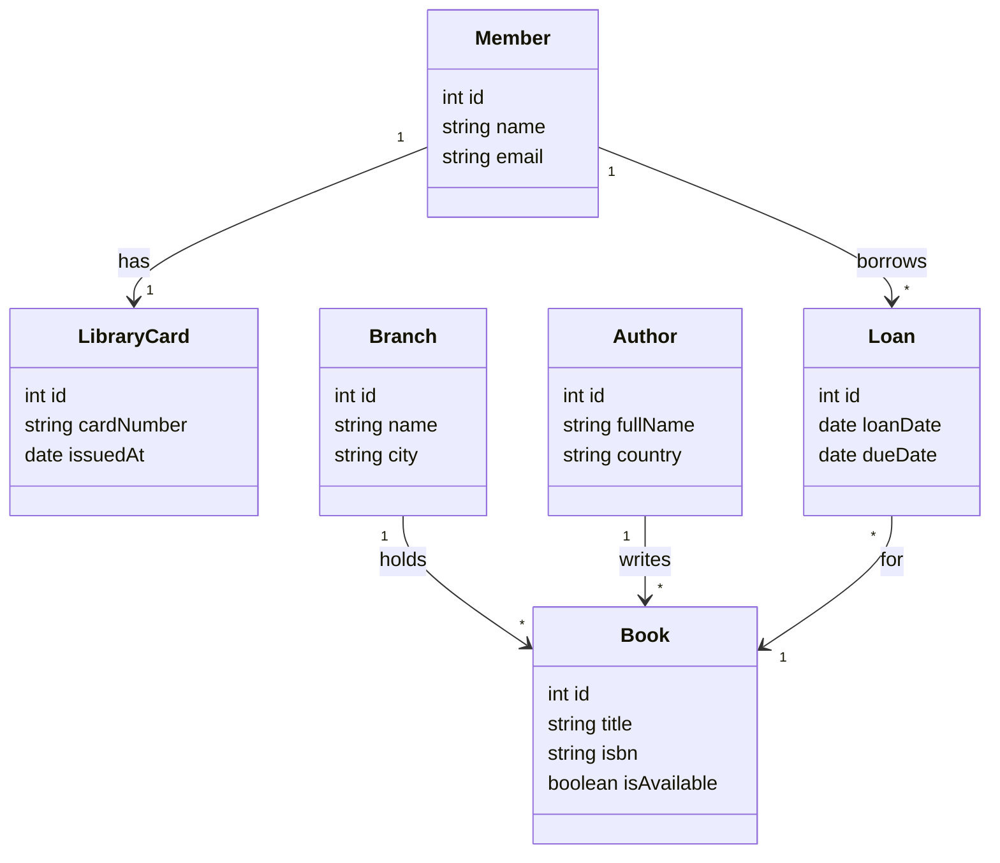

# 10 - Modelo final

Version en ingles: [README.md](./README.md)

## Felicidades

Terminaste la practica guiada. Compara tu modelo en [diagram.4geeks.com](https://diagram.4geeks.com/) con la referencia de abajo. Los nombres y el diseno pueden variar; enfocate en **entidades**, **propiedades tipadas** y **cardinalidades** (1:1, 1:N, N:M).

Marca esta practica LearnPack como **completada** cuando estes conforme con tu diagrama.

## Solucion de referencia (Mermaid)

Una forma valida de representar la biblioteca digital de los pasos 01–09:

## Resumen de relaciones

| Desde | Hacia | Tipo | Notas |
|-------|-------|------|-------|
| `Member` | `LibraryCard` | 1:1 | Un carnet por socio |
| `Branch` | `Book` | 1:N | Una sucursal, muchos libros |
| `Author` | `Book` | 1:N | Un autor, muchos libros (simplificado) |
| `Member` | `Book` | N:M | Mediante `Loan` |

## Que hacer despues

- Exporta un PNG desde diagram.4geeks.com para tu portafolio si quieres.
- Continua con el proyecto [data modeling and class diagrams](https://github.com/4GeeksAcademy/data-modeling-and-class-diagrams) para entregas completas.

## Preguntas de reflexion

1. ¿Podria `Loan` guardar una fecha `returnedAt`? ¿Como cambiaria el modelo?
2. Si un libro tiene varios autores, ¿como ajustarias la relacion `Author`–`Book`?
3. ¿Por que usar una clase de asociacion para los prestamos en lugar de un enlace directo entre `Member` y `Book`?
