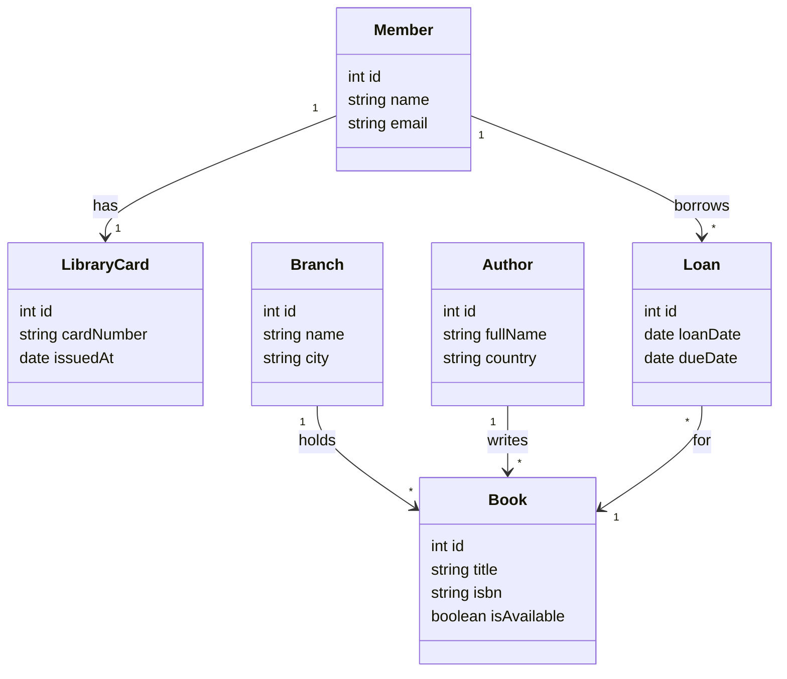

# 10 - Final Model

Spanish version: [README.es.md](./README.es.md)

## Congratulations

You finished the guided practice. Compare your [diagram.4geeks.com](https://diagram.4geeks.com/) model with the reference below. Names and layout may differ; focus on **entities**, **typed properties**, and **cardinalities** (1:1, 1:N, N:M).

Mark this LearnPack practice as **complete** when you are satisfied with your diagram.

## Reference solution (Mermaid)

This is one valid way to represent the digital library from steps 01–09:

## Relationship summary

| From | To | Type | Notes |
|------|-----|------|-------|
| `Member` | `LibraryCard` | 1:1 | One card per member |
| `Branch` | `Book` | 1:N | One branch, many books |
| `Author` | `Book` | 1:N | One author, many books (simplified) |
| `Member` | `Book` | N:M | Through `Loan` |

## What to do next

- Export a PNG from diagram.4geeks.com for your portfolio if you want.
- Continue with the [data modeling and class diagrams](https://github.com/4GeeksAcademy/data-modeling-and-class-diagrams) project for full deliverables.

## Discussion questions

1. Could `Loan` store a `returnedAt` date? How would that change the model?
2. If a book has multiple authors, how would you adjust the `Author`–`Book` relationship?
3. Why use an association class for borrowing instead of a direct link between `Member` and `Book`?
